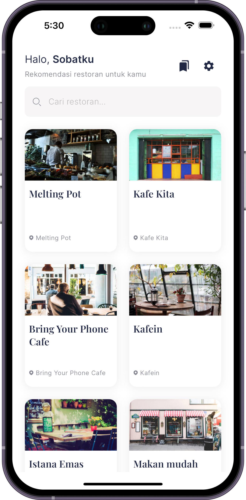
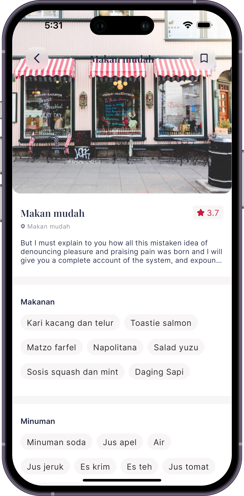
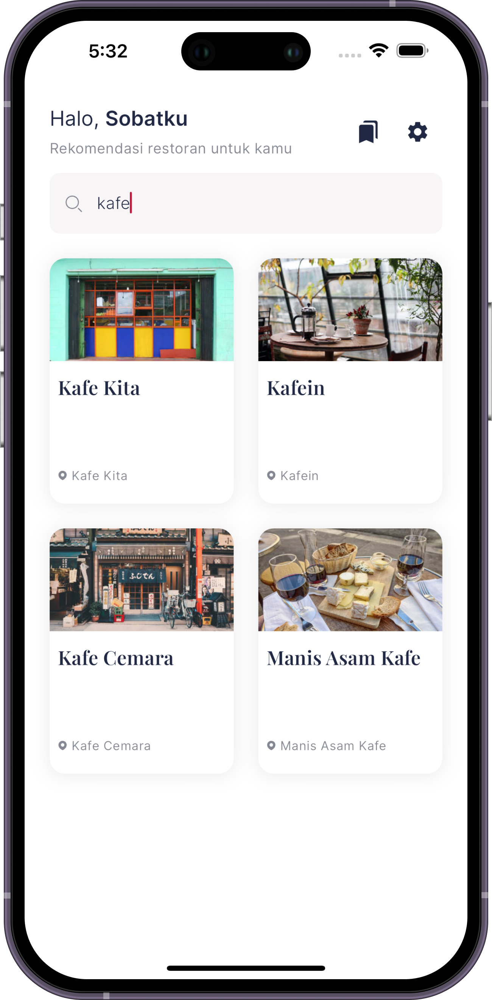
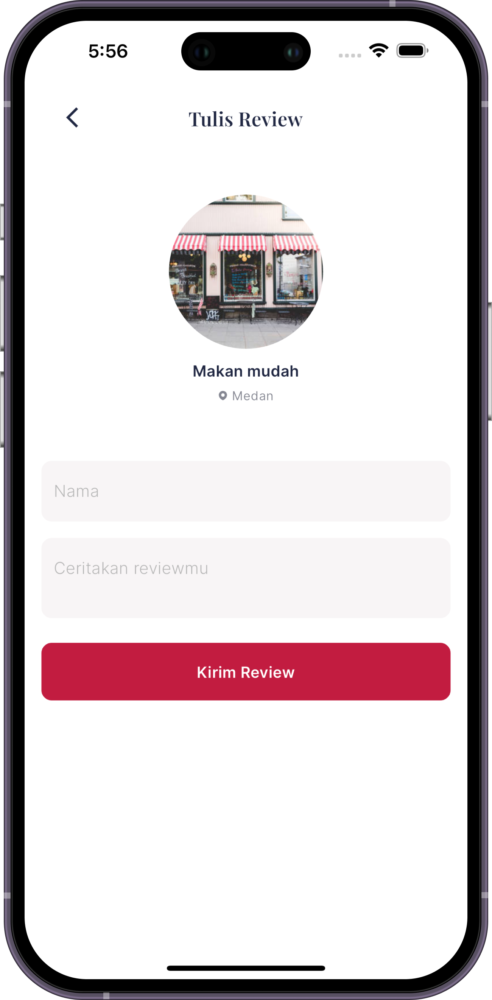
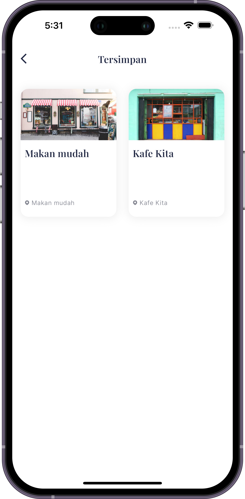
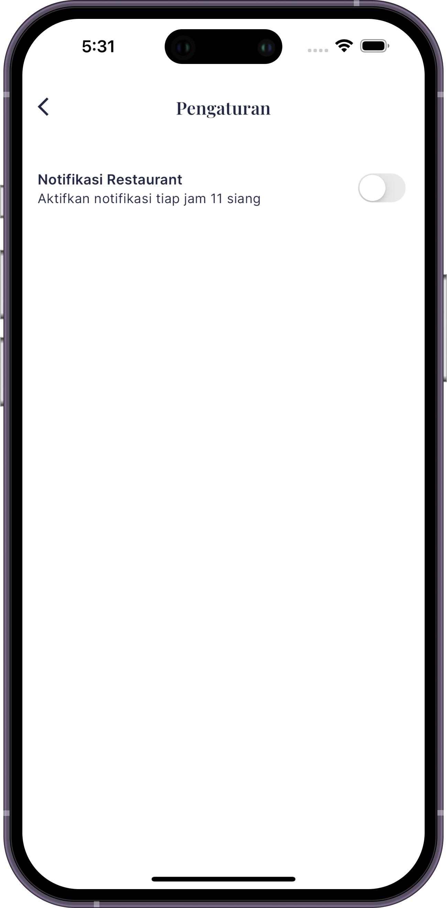

<h1 align="center">
  Restoeev
</h1>

  Restaurant App (Submission Flutter Fundamental Dicoding)

  
  
  

  

## Introduction

Restoeev is a Restaurant Application designed to provide restaurant recommendations, information about foods, drinks, and everything related to dining experiences.

The purpose of this project is to fulfill the requirements of the [Flutter Fundamental Course](https://www.dicoding.com/academies/195) offered by Dicoding. Utilizing the Provider State Management, I have developed this restaurant app. To explore the specific features I have implemented, please refer to the Features section.

In Submission 1, the main focus was on creating a user interface and fetching data from JSON. The features included a restaurant list, restaurant search, and restaurant details.
Submission 2 involved integrating a REST API using the [http package](https://pub.dev/packages/http).
Submission 3 centered around implementing the bookmark feature using Sqflite and integrating notifications with the alarm manager.

## Demo

|Home Screen|Detail Restaurant|Search Restaurant|
|--|--|--|
||||

|Add Review|Bookmark|Setting|
|--|--|--|
||||

## Features

- Show a list of restaurants
- Search restaurants
- Show restaurant details
- Add restaurant review
- Add restaurant to bookmark
- Show bookmark restaurants

## Technology

- Provider for State Management
- http packages to fetch data from API
- SQLite
- Shared Preferences

## Installation

1. Clone this repository
2. Run `flutter pub get`
3. Run `flutter run`